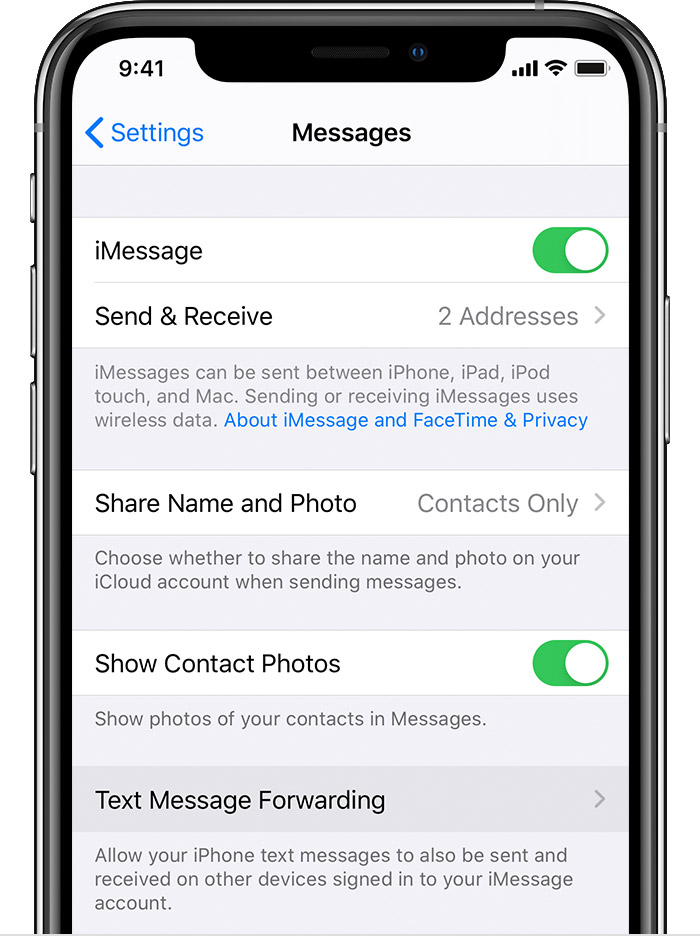
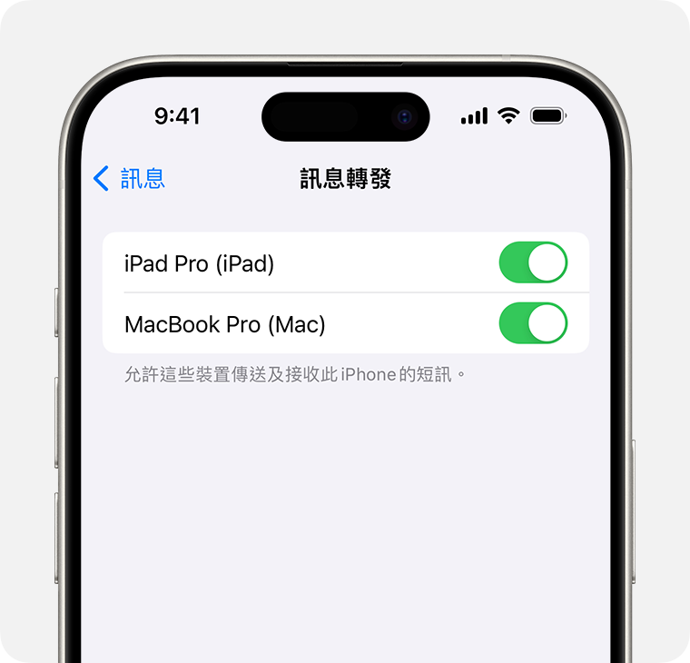

# Secure SMS Forwarding & Cost Management Guide
# 安全短訊轉發與成本管理指南

This guide focuses on managing a China Mainland SIM card (China Mobile, Unicom, Telecom, or MVNO) from overseas. By utilizing the Apple ecosystem, users can receive SMS verification codes while minimizing costs and ensuring personal privacy.  
本指南專注於如何在境外管理中國大陸 SIM 卡（移動、聯通、電信或虛擬運營商）。透過 Apple 生態系統，用戶可以在確保隱私並規避國際漫遊費用的情況下，接收短訊 (SMS) 驗證碼。

---

## 1. Core Advantage / 方案核心優勢

Unlike traditional roaming, this setup **does not require** the China Mainland SIM card to have international roaming enabled.  
與傳統漫遊不同，此方案**不需要**中國大陸 SIM 卡開通國際漫遊功能。

* **Privacy & Information Protection / 隱私與資訊保護**  
    The SIM card remains in China Mainland at all times. Base station triangulation will always show the device within China Mainland, thereby **protecting your personal privacy and information** by decoupling your actual overseas presence from your China Mainland service.  
    SIM 卡永遠留在中國大陸境內。基站定位將始終顯示設備位於境內環境，從而**保護你的個人隱私與資訊**，使你真實的境外行蹤與中國大陸通訊服務完全脫鉤。

* **Cost Efficiency / 資費優勢**  
    Receive all SMS (Bank OTPs, App alerts) for free. Any replies sent via the forwarded system are charged at **domestic rates** in China Mainland rather than expensive international roaming rates.    
    免費接收所有短訊（銀行驗證碼、App 通知）。經由轉發系統發出的短訊按中國大陸**境內標準資費** 收費，而非高昂的國際漫遊費用。

---

## 2. Hardware & Version Requirements / 硬件與版本實測要求

Based on actual testing, hardware requirements vary depending on your needs:  
根據實際測試，硬件要求取決於你的使用需求：

* **Receive Only / 僅接收短訊**  
    Older devices like **iPhone 6s** can be used to receive forwarded messages  
    較舊的設備如 **iPhone 6s** 可用於接收轉發的短訊

* **Full Support (Send & Receive) / 完整功能 (接收與發送)**  
    To support sending SMS from your overseas device via the China Mainland iPhone, both devices should ideally run **iOS 18.x**. (Tested successfully using **iPhone SE2**)  
    若境外手機需要支持透過中國大陸 iPhone 遠端發送短訊，設備需支持 **iOS 18.x**

---

## 3. Security & Anti-Fraud Reminder / 安全設定與防騙提醒

This system relies on iMessage. Please be vigilant about the identity of message senders:  
此系統依賴 iMessage 運行。請務必警惕信息發送者的身份：

* **Identify Message Types / 識別信息類型**  
    Blue bubbles indicate iMessage, while green bubbles indicate standard SMS  
    藍色氣泡為 iMessage，綠色氣泡為標準短訊

* **Check Sender ID / 檢查發送者身份**  
    Since iMessage supports sending via email, scammers often use random emails to send fraudulent messages. **Always check if the sender is an email address** and confirm if they are a trusted contact to prevent scams  
    由於 iMessage 支持使用電郵發送，詐騙者常利用隨機電郵發送訊息。請仔細查看發送者是否為電郵地址，並確認對方是否為你熟悉的聯繫人，以防受騙

---

## 4. Configuration Checklist / 配置清單與參考

1.  **iMessage Sync / iMessage 同步**  
    Both devices must be signed into the same Apple ID with iMessage **ON** in **Settings > Messages**  
    兩台設備必須登錄同一個 Apple ID 並在「設定」>「訊息」中開啟「iMessage」

2.  **Enable Forwarding / 開啟轉發**  
    On the **China Mainland device**, go to **Settings > Messages > Text Message Forwarding** and toggle **ON** for your overseas device  
    在**中國大陸設備**上，前往「設定」>「訊息」>「文本信息轉發」，開啟境外隨身設備的開關

3.  **Official Reference / 官方參考**  
    [How to forward SMS/MMS text messages (Apple Support)](https://support.apple.com/en-hk/102545)  
    [如何將 iPhone 的 SMS/MMS 訊息轉發至 iPad 或 Mac (Apple 支援)](https://support.apple.com/zh-hk/HT208386)  
    

  
  
    

---

## 5. Important Technical Tips / 重要技術提示

* **Connectivity / 連接**  
    Use **Wi-Fi** primarily on the China Mainland device to avoid data charges. **Cellular Data** can be a backup but but will **incur extra charges**    
    中國大陸設備應優先使用 **Wi-Fi** 以節省費用。流動數據僅建議作為備援，但會**產生額外費用**

* **Power / 電源**  
    Keep the China Mainland device permanently connected to a charger  
    確保中國大陸設備長期連接電源

* **Voice Call Handling (Voicemail) / 語音通話處理（語音信箱）**  
Because iMessage only forwards SMS, use Conditional Call Forwarding to handle incoming calls.  
因为 iMessage 僅能轉發短訊，建議設置有條件呼叫轉移以處理來電。
  * **China Mobile / 中國移動:**
    * Action: Dial \*\*61\*12599\*11\*8\# (8s delay, range 5-30s); 3 RMB/mo or 30 RMB/year.  
      操作與資費： 撥打 \*\*61\*12599\*11\*8\#（設置響鈴 8 秒轉移，範圍 5-30 秒）；資費約 3 元/月或 30 元/年（需另行開通）。
    * Access: Listen to voice notes via the "He Liu Yan" (Voicemail) WeChat Mini-program.  
      收聽方式： 可透過「和留言」(Voicemail) 微信小程序收聽語音留言。
  * **Other Carriers / 其他運營商:**  
    Similar voicemail services are available for China Unicom and China Telecom.  
    中國聯通與中國電信亦有提供類似的語音信箱服務。
* **Anti-Deactivation (Active Usage) / 模擬人工操作（防停機）**  
  Because carriers may flag a SIM as "dormant" if unused, perform an active operation every 30 days.  
  因為運營商可能將長期未使用的 SIM 卡判定為「休眠」，建議每 30 天內進行一次主動操作。

  * Action & Timing: Send CXYE (Balance) or CXLL (Data) to 10086 (or 10010/10001) during China business hours (9 AM - 10 PM).  
    操作與時機： 在中國大陸白天時間 (9 AM - 10 PM) 發送 CXYE 或 CXLL 至 10086（或 10010/10001）。
  * Future Update: A Shortcuts + Python script with random delays will be provided to automate this.  
    未來更新： 將提供基於捷徑 + 隨機 Python 延遲的自動化腳本，以實現自動發送。

---

## 6. User Case / 實際使用案例

**Equipment Configuration:**
* **Primary Phone:** Daily driver used overseas (Non-China Mainland Apple ID).
* **Syncing Pair:** Two **iPhone SE2** units sharing a single **China Mainland Apple ID** (operated by iCloud China).
    * **Device A:** Stays in China Mainland with the SIM card permanently installed   
    * **Device B:** Carried overseas. Most App location services and **Background App Refresh (background operation)** are disabled, except for essential system location services  
* **Maintenance:** Device B sends a balance check SMS once a month to keep the line active.

**設備配置參考：**
* **主力手機：** 海外日常使用（非中國大陸 Apple ID）
* **同步組合：** 兩部 **iPhone SE2**，共享同一個**中國大陸 Apple ID**（由雲上貴州營運）
    * **設備 A：** 帶有 SIM 卡，永遠放置於中國大陸境內
    * **設備 B：** 隨身攜帶。除了系統必須的定位外，關閉了大多數 App 的定位權限及**背景 App（後台運行）**
* **日常維護：** 設備 B 每月定期發送查詢短訊，模擬人工主動使用。
---

## Author / 作者 : **Jacob Wong**

## Contact / 聯繫方式
* **Email:** github@linux.dscloud.me
* **Note:** Feel free to open an **Issue** if you have questions or want to report your device compatibility
* **備註：** 如有任何疑問或希望回饋設備兼容性測試結果，歡迎联络

## License / 授權
This project is licensed under the MIT License  
本項目採用MIT 授權條款